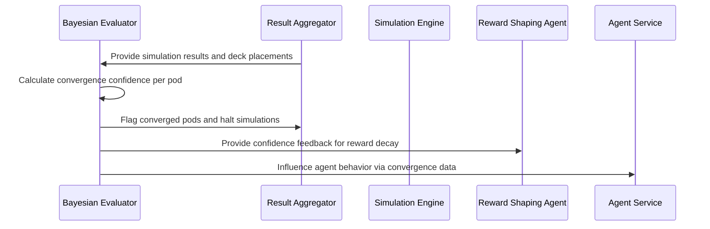

# Bayesian Evaluator

## Purpose
The `bayesian-evaluator` uses statistical convergence models to determine when enough simulations have been run to confidently rank decks within a pod. It prevents wasted computation, supports adaptive training, and informs reward decay and exploration tuning in connected services.

## Responsibilities
- Monitor match results across pods.
- Apply Bayesian convergence modeling to win/placement data.
- Emit per-deck and per-matchup confidence scores.
- Flag pods as converged once confidence targets are met (e.g., 99%, 99.999%).
- Influence agent behavior and reward shaping via confidence feedback.
- Optionally identify anomalies, regression trends, or non-stationary behavior across epochs.
- **Error Handling**: Gracefully handle incomplete or erroneous convergence signals, logging relevant warnings for transparency.

## Key Features
- Configurable confidence thresholds per training configuration or format.
- Models uncertainty in pod-level outcomes, deck rankings, and archetype performance.
- Triggers convergence signals to halt pod simulation and initiate downstream reward and model updates.
- Emits convergence feedback to the `agent-service` and `reward-shaping-agent`.
- Supports audit trails for long-running simulations and meta drift detection.

## Inputs
- Pod simulation results from `result-aggregator`
- Configuration parameters:
  - Confidence level (e.g., 99.9%)
  - Minimum games per pod
  - Deck count per pod
- Historical placement data and sample count

## Outputs
- Pod convergence flag
- Confidence interval per deck (e.g., 1st/2nd/3rd/4th placement)
- Matchup-specific convergence variance matrix
- Optional feedback signal to reward and agent modules
- Diagnostic logs for rebalancing or undertrained pods

## Execution Flow

## Integration Points
- Pulls simulation results from `result-aggregator`
- Signals convergence to `pod-meta-controller` and `matchmaker`
- Sends training signals to `agent-service` (confidence, stability)
- Shares tag or matchup convergence trends with `reward-shaping-agent`
- Supports replay auditing through `replay-indexer` or `dashboard`

## Deployment
- Lightweight Python service
- Runs periodically or reacts to Kafka events
- Containerized for cluster-wide convergence evaluation

## Notes
The Bayesian Evaluator is critical for determining simulation sufficiency, controlling exploration, decaying stale rewards, and managing compute efficiency. It provides a mathematically grounded convergence layer to ensure rankings and policy improvements are statistically robust.
