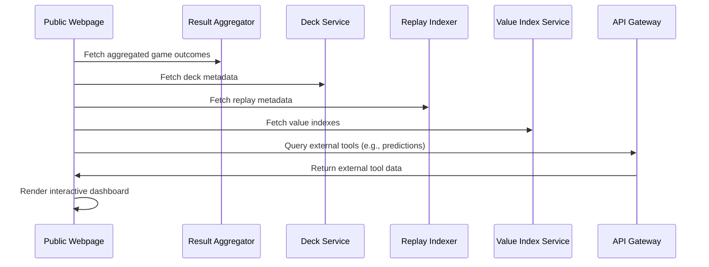

# Public Webpage

## Purpose
The `public-webpage` provides a centralized, EDHREC-style dashboard for users to explore simulation results, deck rankings, meta insights, and contributed games. It serves as the primary user-facing view into the platform’s data and AI output, enabling transparency and community interaction.

## Responsibilities
- Display searchable deck statistics, win rates, and archetype analysis.
- Serve replays, annotations, and value indexes.
- Highlight community contributors and simulation leaderboards.
- Provide educational overlays and model insights from AI training.
- Link to tools for prediction, submission, and feedback.

## Key Features
- Commander and decklist browser with filters.
- Deck vs. meta matchup explorer.
- Replay gallery with tagging and explanation overlays.
- Value tracker (price vs. performance).
- Public leaderboard of volunteer simulators.
- **Error Handling**: Graceful error messages for missing data or simulation failures.

## Inputs
- Aggregated game outcomes from `result-aggregator`
- Deck metadata from `deck-service`
- Replay metadata and logs from `replay-indexer`
- Card IRs and prices from `card-ir-registry` and `value-index-service`
- User feedback, annotations, and predictions

## Outputs
- HTML/JS-based interactive dashboard
- API data queries to `api-gateway`
- Optional CSV/JSON export for advanced users

## Execution Flow

## Integration Points
- Queries:
   - `api-gateway`
   - `replay-indexer`
   - `value-index-service`
   - `deck-service`
   - `auth-service` (if login features enabled)

## Deployment
- Static frontend app (React/Vue/Svelte) served via CDN or backend
- Connects to backend through REST APIs or GraphQL
- Scalable caching and optional SSR for SEO and performance
