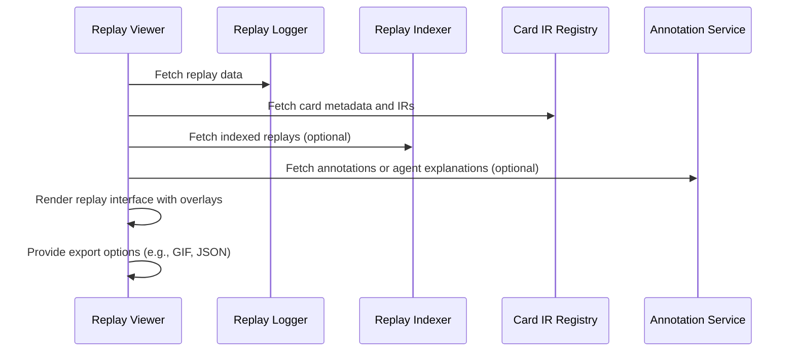

# Replay Viewer

## Purpose
The `replay-viewer` provides an interactive, browser-based interface for visualizing completed simulations. It enables step-by-step review of gameplay, strategic analysis, and public transparency.

## Responsibilities
- Render game state transitions from replay logs.
- Display player actions, card plays, life totals, stack interactions, and triggers.
- Support turn-by-turn and phase-by-phase navigation.
- Overlay annotations and AI explanations (if available).

## Key Features
- Timeline-based playback with highlights.
- Card and stack hover previews using Scryfall art + Oracle text.
- Display of agent confidence scores or explanation traces.
- Integration with `annotation-service` for tagged insights.
- **Error Handling**: Graceful handling of corrupted or incomplete replay data with fallback error messages.

## Inputs
- Replay logs from `replay-logger` or `replay-indexer`
- Card metadata and IRs from `card-ir-registry`
- Optional annotations or agent explanations

## Outputs
- Rendered HTML/CSS/JS interface with interactive replay
- Replay export options (e.g., GIF, JSON trace)
- Optional links to `public-webpage` and prediction tools

## Execution Flow

## Integration Points
- Pulls data from:
   - `replay-logger`
   - `replay-indexer`
   - `card-ir-registry`
   - `annotation-service`
   - `explanation-service`
- Links from `public-webpage` deck profile or leaderboard

## Deployment
- Served as a frontend JS bundle or embedded in `ui-client`
- Backed by `api-gateway` for secure replay access
- Replay data streamed from object store or database
